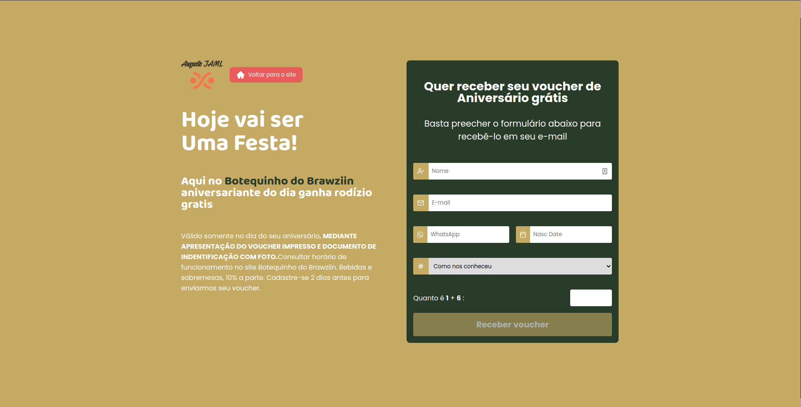

# ReactJS Birthday

application in ReacJS using the API [Laravel Happy Birthday](https://github.com/augustojaml/laravel-api-happy-birthday)

# Home Page

# Form Page

# Congratulations Page

# Admin Page

# Dashboard Page

- [x] - Create mask for whatsapp and date of birth
- [x] - Create components inputs
- [x] - Validate input captcha
- [x] - Get all messages errors in validate and show in form
- [x] - Check page without content in routes login and dashboard
- [x] - Config template email in API
- [x] - Send voucher for database and email
- [x] - Show page congratulation
- [x] - Config loading in button receive voucher
